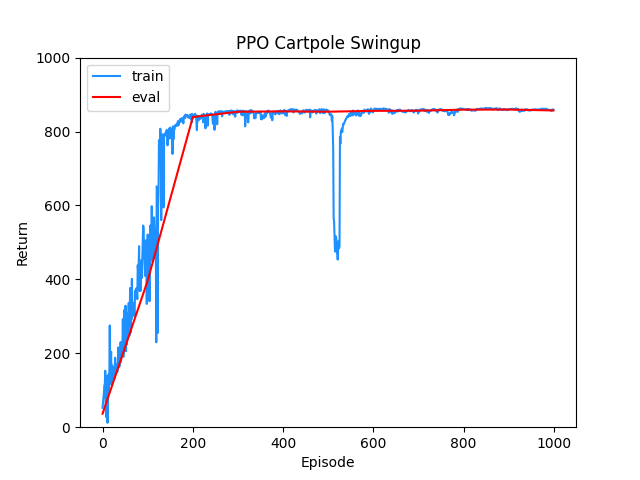
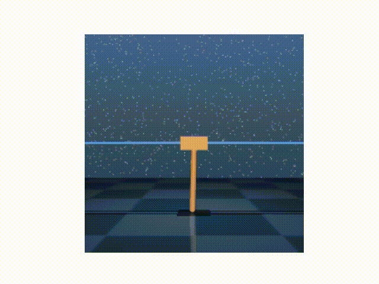
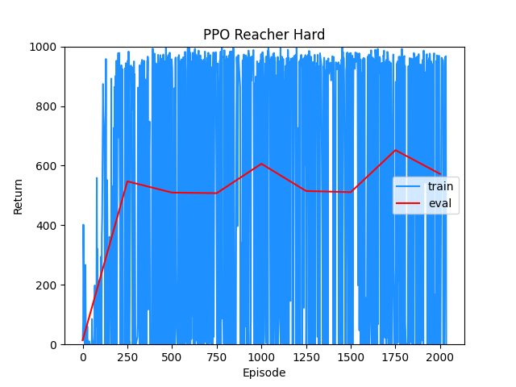
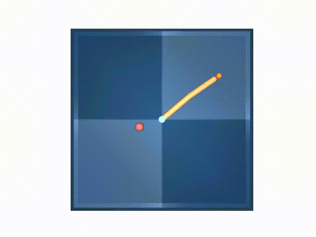

# PPO-Pytorch
A clean and minimal implementation of PPO (Proximal Policy Optimization) algorithm in Pytorch, for continuous action spaces.

## References
* "Proximal Policy Optimization Algorithms", Schulman et al. [Link](https://arxiv.org/abs/1707.06347).

## Tested on

* Cartpole Swingup ([Deepmind Control Suite](https://github.com/deepmind/dm_control/tree/master/dm_control/suite)) - Swing up and balance an unactuated pole by applying forces to a cart at its base.

* Reacher Hard ([Deepmind Control Suite](https://github.com/deepmind/dm_control/tree/master/dm_control/suite)) - Control a two-link robotic arm to reach a randomized target location.

